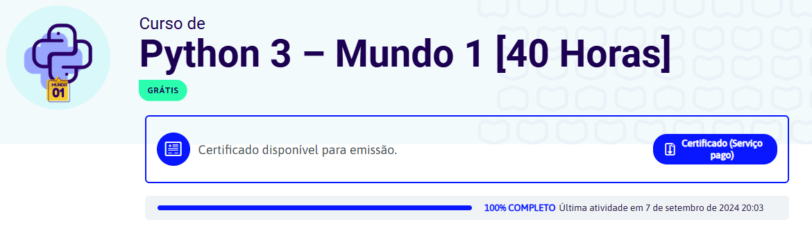

# Improving my Python
In this repository, I'm going to store my learnings and exercises from professor's Gustavo Guanabara course, from Curso em Video YouTube channel, about Python 3.

Since the course starts at a beginner level, I will register all my progress from the beginning to the end, with the aim of analyzing my improvement in logical solution and functional codes creation.

knowing that, to receive the certificate, I must take a test on the course's official website and if I get more than 70% correct, I must pay an amount in BRL for each of the 3 certificates (3 worlds) of this course.

I saw as a parallel alternative the sharing of my entire journey here in this repository. Because even without paying for the certificates, I will absorb the knowledge.

### Course Information
- <b>Title:</b> Curso de Python 3
- <b>Instructor:</b> Professor Gustavo Guanabara
- <b>Link:</b> [\[YouTube Playlist Link\]](https://youtu.be/S9uPNppGsGo)
- <b>Website:</b> [\[Website Link\]](https://www.cursoemvideo.com/)

### Repository Structure
```
├── imgs/
│   └── certificates.png
├── worlds/
│   ├── classes/
│   │   └── classes.py
│   └── exercises/
│       └── exercises.py
└── README.md
```
> There are 3 Worlds, and in each of them there will be the same organizational structure.

### Running the Code
If you want to explore something, follow these steps:

1. Clone the repository:
```bash
git clone https://github.com/lohanjr/CursoEmVideo-Python-Course.git
```

2. Navigate to repository:
```bash
cd CursoEmVideo-Python-Course
```

3. And then, run a Python script:
```bash
# Just an exemple
python3 world_01/exercises/ex028.py
```

## Progress

Here is a visual proof of my progress through the Worlds:

- <b>World 1:</b>
  

I will continue updating this section as I complete more Worlds.